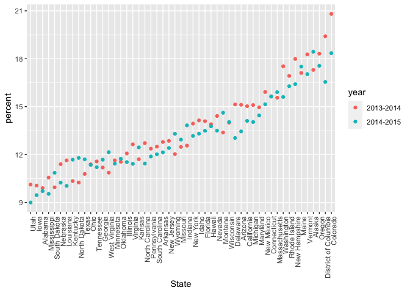

reading_data_from_the_web
================
Zuoqiao Cui
2022-10-11

``` r
library(tidyverse)
```

    ## ── Attaching packages ─────────────────────────────────────── tidyverse 1.3.2 ──
    ## ✔ ggplot2 3.3.6      ✔ purrr   0.3.4 
    ## ✔ tibble  3.1.8      ✔ dplyr   1.0.10
    ## ✔ tidyr   1.2.0      ✔ stringr 1.4.1 
    ## ✔ readr   2.1.2      ✔ forcats 0.5.2 
    ## ── Conflicts ────────────────────────────────────────── tidyverse_conflicts() ──
    ## ✖ dplyr::filter() masks stats::filter()
    ## ✖ dplyr::lag()    masks stats::lag()

``` r
library(rvest)
```

    ## 
    ## Attaching package: 'rvest'
    ## 
    ## The following object is masked from 'package:readr':
    ## 
    ##     guess_encoding

``` r
library(httr)
```

``` r
url = "http://samhda.s3-us-gov-west-1.amazonaws.com/s3fs-public/field-uploads/2k15StateFiles/NSDUHsaeShortTermCHG2015.htm"
drug_use_html = read_html(url)

drug_use_html
```

    ## {html_document}
    ## <html lang="en">
    ## [1] <head>\n<link rel="P3Pv1" href="http://www.samhsa.gov/w3c/p3p.xml">\n<tit ...
    ## [2] <body>\r\n\r\n<noscript>\r\n<p>Your browser's Javascript is off. Hyperlin ...

``` r
drug_use_html %>%
  html_table() %>% 
  first() %>% ##只要第一个table
  slice(-1) ##去掉第一行:note
```

    ## # A tibble: 56 × 16
    ##    State 12+(2…¹ 12+(2…² 12+(P…³ 12-17…⁴ 12-17…⁵ 12-17…⁶ 18-25…⁷ 18-25…⁸ 18-25…⁹
    ##    <chr> <chr>   <chr>   <chr>   <chr>   <chr>   <chr>   <chr>   <chr>   <chr>  
    ##  1 Tota… 12.90a  13.36   0.002   13.28b  12.86   0.063   31.78   32.07   0.369  
    ##  2 Nort… 13.88a  14.66   0.005   13.98   13.51   0.266   34.66a  36.45   0.008  
    ##  3 Midw… 12.40b  12.76   0.082   12.45   12.33   0.726   32.13   32.20   0.900  
    ##  4 South 11.24a  11.64   0.029   12.02   11.88   0.666   28.93   29.20   0.581  
    ##  5 West  15.27   15.62   0.262   15.53a  14.43   0.018   33.72   33.19   0.460  
    ##  6 Alab… 9.98    9.60    0.426   9.90    9.71    0.829   26.99   26.13   0.569  
    ##  7 Alas… 19.60a  21.92   0.010   17.30   18.44   0.392   36.47a  40.69   0.015  
    ##  8 Ariz… 13.69   13.12   0.364   15.12   13.45   0.131   31.53   31.15   0.826  
    ##  9 Arka… 11.37   11.59   0.678   12.79   12.14   0.538   26.53   27.06   0.730  
    ## 10 Cali… 14.49   15.25   0.103   15.03   14.11   0.190   33.69   32.72   0.357  
    ## # … with 46 more rows, 6 more variables: `26+(2013-2014)` <chr>,
    ## #   `26+(2014-2015)` <chr>, `26+(P Value)` <chr>, `18+(2013-2014)` <chr>,
    ## #   `18+(2014-2015)` <chr>, `18+(P Value)` <chr>, and abbreviated variable
    ## #   names ¹​`12+(2013-2014)`, ²​`12+(2014-2015)`, ³​`12+(P Value)`,
    ## #   ⁴​`12-17(2013-2014)`, ⁵​`12-17(2014-2015)`, ⁶​`12-17(P Value)`,
    ## #   ⁷​`18-25(2013-2014)`, ⁸​`18-25(2014-2015)`, ⁹​`18-25(P Value)`

``` r
swm_html = 
  read_html("https://www.imdb.com/list/ls070150896/")
sw_titles = 
  swm_html %>% 
  html_elements(".lister-item-header a") %>% 
  html_text()
runtime_vec = 
  swm_html %>%
  html_elements(".runtime") %>%
  html_text()
sw_df = 
  tibble(
    title = sw_titles,
    run_time = runtime_vec
  )
```

## APIs

``` r
nyc_water = 
  GET("https://data.cityofnewyork.us/resource/ia2d-e54m.csv") %>% 
  content("parsed")
```

    ## Rows: 43 Columns: 4
    ## ── Column specification ────────────────────────────────────────────────────────
    ## Delimiter: ","
    ## dbl (4): year, new_york_city_population, nyc_consumption_million_gallons_per...
    ## 
    ## ℹ Use `spec()` to retrieve the full column specification for this data.
    ## ℹ Specify the column types or set `show_col_types = FALSE` to quiet this message.

``` r
nyc_water = 
  GET("https://data.cityofnewyork.us/resource/ia2d-e54m.json") %>% 
  content("text")%>%
  jsonlite::fromJSON()
```

``` r
brfss_sdf= 
  GET("https://chronicdata.cdc.gov/resource/acme-vg9e.csv", query = list("$limit" = 5000)) %>% 
  content("parsed")
```

    ## Rows: 5000 Columns: 23
    ## ── Column specification ────────────────────────────────────────────────────────
    ## Delimiter: ","
    ## chr (16): locationabbr, locationdesc, class, topic, question, response, data...
    ## dbl  (6): year, sample_size, data_value, confidence_limit_low, confidence_li...
    ## lgl  (1): locationid
    ## 
    ## ℹ Use `spec()` to retrieve the full column specification for this data.
    ## ℹ Specify the column types or set `show_col_types = FALSE` to quiet this message.

pokemon

``` r
poke = 
  GET("http://pokeapi.co/api/v2/pokemon/1") %>%
  content()

names(poke)
```

    ##  [1] "abilities"                "base_experience"         
    ##  [3] "forms"                    "game_indices"            
    ##  [5] "height"                   "held_items"              
    ##  [7] "id"                       "is_default"              
    ##  [9] "location_area_encounters" "moves"                   
    ## [11] "name"                     "order"                   
    ## [13] "past_types"               "species"                 
    ## [15] "sprites"                  "stats"                   
    ## [17] "types"                    "weight"

``` r
poke[["weight"]]
```

    ## [1] 69

## string

``` r
library(rvest)
library(p8105.datasets)
```

``` r
#detect whether this word or character exists

string_vec = c("my", "name", "is", "jeff")

str_detect(string_vec, "jeff")
```

    ## [1] FALSE FALSE FALSE  TRUE

``` r
str_detect(string_vec, "e")
```

    ## [1] FALSE  TRUE FALSE  TRUE

``` r
# sensitive to capital
str_detect(string_vec, "J")
```

    ## [1] FALSE FALSE FALSE FALSE

``` r
#change the capital
str_replace(string_vec,"jeff","Jeff")
```

    ## [1] "my"   "name" "is"   "Jeff"

``` r
string_vec = c(
  "i think we all rule for participating",
  "i think i have been caught",
  "i think this will be quite fun actually",
  "it will be fun, i think"
  )

str_detect(string_vec, "^i think") # i think should be start
```

    ## [1]  TRUE  TRUE  TRUE FALSE

``` r
str_detect(string_vec, "i think$") # i think should be ended
```

    ## [1] FALSE FALSE FALSE  TRUE

``` r
string_vec = c(
  "Y'all remember Pres. HW Bush?",
  "I saw a green bush",
  "BBQ and Bushwalking at Molonglo Gorge",
  "BUSH -- LIVE IN CONCERT!!"
  )

str_detect(string_vec,"[Bb]ush") # low or capital B, match both of them
```

    ## [1]  TRUE  TRUE  TRUE FALSE

``` r
string_vec = c(
  '7th inning stretch',
  '1st half soon to begin. Texas won the toss.',
  'she is 5 feet 4 inches tall',
  '3AM - cant sleep :('
  )

str_detect(string_vec, "^[0-9][a-zA-Z]") #number is followed by a 字母
```

    ## [1]  TRUE  TRUE FALSE  TRUE

``` r
string_vec = c(
  'Its 7:11 in the evening',
  'want to go to 7-11?',
  'my flight is AA711',
  'NetBios: scanning ip 203.167.114.66'
  )

str_detect(string_vec, "7.11")  #.matches all kinds of special character
```

    ## [1]  TRUE  TRUE FALSE  TRUE

``` r
str_detect(string_vec, "7\\.11")  # in this way, . is not a special character anymore
```

    ## [1] FALSE FALSE FALSE  TRUE

``` r
string_vec = c(
  'The CI is [2, 5]',
  ':-]',
  ':-[',
  'I found the answer on pages [6-7]'
  )

str_detect(string_vec, "\\[")
```

    ## [1]  TRUE FALSE  TRUE  TRUE

## factor

``` r
vec_sex = factor(c("male", "male", "female", "female"))
vec_sex
```

    ## [1] male   male   female female
    ## Levels: female male

``` r
as.numeric(vec_sex)
```

    ## [1] 2 2 1 1

relevel…

``` r
vec_sex = fct_relevel(vec_sex,"male") # change the first level i want
vec_sex
```

    ## [1] male   male   female female
    ## Levels: male female

``` r
as.numeric(vec_sex)
```

    ## [1] 1 1 2 2

## NSDUH

``` r
nsduh_url = "http://samhda.s3-us-gov-west-1.amazonaws.com/s3fs-public/field-uploads/2k15StateFiles/NSDUHsaeShortTermCHG2015.htm"

table_marj = 
  read_html(nsduh_url) %>% 
  html_table() %>% 
  first() %>%
  slice(-1)
```

``` r
data_marj = 
   table_marj %>%
  select(-contains("P Value")) %>%
  pivot_longer(
    -State,
    names_to = "age_year", 
    values_to = "percent") %>%
  separate(age_year, into = c("age", "year"), sep = "\\(") %>%
  mutate(
    year = str_replace(year, "\\)", ""),
    percent = str_replace(percent, "[a-c]$", ""),
    percent = as.numeric(percent)) %>%
  filter(!(State %in% c("Total U.S.", "Northeast", "Midwest", "South", "West")))
```

## NSDUN===factor

``` r
data_marj %>%
  filter(age == "12-17") %>% 
  mutate(State = fct_reorder(State, percent)) %>% #reorder according to percent
  ggplot(aes(x = State, y = percent, color = year)) + 
    geom_point() + 
    theme(axis.text.x = element_text(angle = 90, hjust = 1))
```

<!-- -->

## weather data

``` r
weather_df = 
  rnoaa::meteo_pull_monitors(
    c("USW00094728", "USC00519397", "USS0023B17S"),
    var = c("PRCP", "TMIN", "TMAX"), 
    date_min = "2017-01-01",
    date_max = "2017-12-31") %>%
  mutate(
    name = recode(
      id, 
      USW00094728 = "CentralPark_NY", 
      USC00519397 = "Waikiki_HA",
      USS0023B17S = "Waterhole_WA"),
    tmin = tmin / 10,
    tmax = tmax / 10) %>%
  select(name, id, everything())
```

    ## Registered S3 method overwritten by 'hoardr':
    ##   method           from
    ##   print.cache_info httr

    ## using cached file: ~/Library/Caches/R/noaa_ghcnd/USW00094728.dly

    ## date created (size, mb): 2022-09-28 15:06:12 (8.401)

    ## file min/max dates: 1869-01-01 / 2022-09-30

    ## using cached file: ~/Library/Caches/R/noaa_ghcnd/USC00519397.dly

    ## date created (size, mb): 2022-09-28 15:06:15 (1.699)

    ## file min/max dates: 1965-01-01 / 2020-03-31

    ## using cached file: ~/Library/Caches/R/noaa_ghcnd/USS0023B17S.dly

    ## date created (size, mb): 2022-09-28 15:06:17 (0.95)

    ## file min/max dates: 1999-09-01 / 2022-09-30

``` r
weather_df %>% 
  mutate(
    name = fct_reorder(name,tmax)
  ) %>% 
  ggplot(aes(x = name, y = tmax)) + 
  geom_violin(aes(fill = name), color = "blue", alpha = .5) + 
  theme(legend.position = "bottom")
```

    ## Warning: Removed 3 rows containing non-finite values (stat_ydensity).

<!-- -->

``` r
weather_df %>% 
  lm(tmax ~ name,data = .)
```

    ## 
    ## Call:
    ## lm(formula = tmax ~ name, data = .)
    ## 
    ## Coefficients:
    ##      (Intercept)    nameWaikiki_HA  nameWaterhole_WA  
    ##           17.366            12.291            -9.884

``` r
data("rest_inspec")
rest_inspec %>% 
  group_by(boro, grade) %>% 
  summarize(n = n()) %>% 
  pivot_wider(names_from = grade, values_from = n)
```

    ## `summarise()` has grouped output by 'boro'. You can override using the
    ## `.groups` argument.

    ## # A tibble: 6 × 8
    ## # Groups:   boro [6]
    ##   boro              A     B     C `Not Yet Graded`     P     Z  `NA`
    ##   <chr>         <int> <int> <int>            <int> <int> <int> <int>
    ## 1 BRONX         13688  2801   701              200   163   351 16833
    ## 2 BROOKLYN      37449  6651  1684              702   416   977 51930
    ## 3 MANHATTAN     61608 10532  2689              765   508  1237 80615
    ## 4 Missing           4    NA    NA               NA    NA    NA    13
    ## 5 QUEENS        35952  6492  1593              604   331   913 45816
    ## 6 STATEN ISLAND  5215   933   207               85    47   149  6730

``` r
rest_inspec =
  rest_inspec %>%
  filter(grade %in% c("A", "B", "C"), boro != "Missing") %>% 
  mutate(boro = str_to_title(boro))
```

``` r
rest_inspec %>% 
  filter(str_detect(dba, "Pizza")) %>% 
  group_by(boro, grade) %>% 
  summarize(n = n()) %>% 
  pivot_wider(names_from = grade, values_from = n)
```

    ## `summarise()` has grouped output by 'boro'. You can override using the
    ## `.groups` argument.

    ## # A tibble: 5 × 3
    ## # Groups:   boro [5]
    ##   boro              A     B
    ##   <chr>         <int> <int>
    ## 1 Bronx             9     3
    ## 2 Brooklyn          6    NA
    ## 3 Manhattan        26     8
    ## 4 Queens           17    NA
    ## 5 Staten Island     5    NA

``` r
rest_inspec %>% 
  filter(str_detect(dba, "[Pp][Ii][Zz][Zz][Aa]")) %>%
  mutate(
    boro = fct_infreq(boro) #most frequency
  ) %>% 
  ggplot(aes(x = boro)) + 
  geom_bar() 
```

<!-- -->
